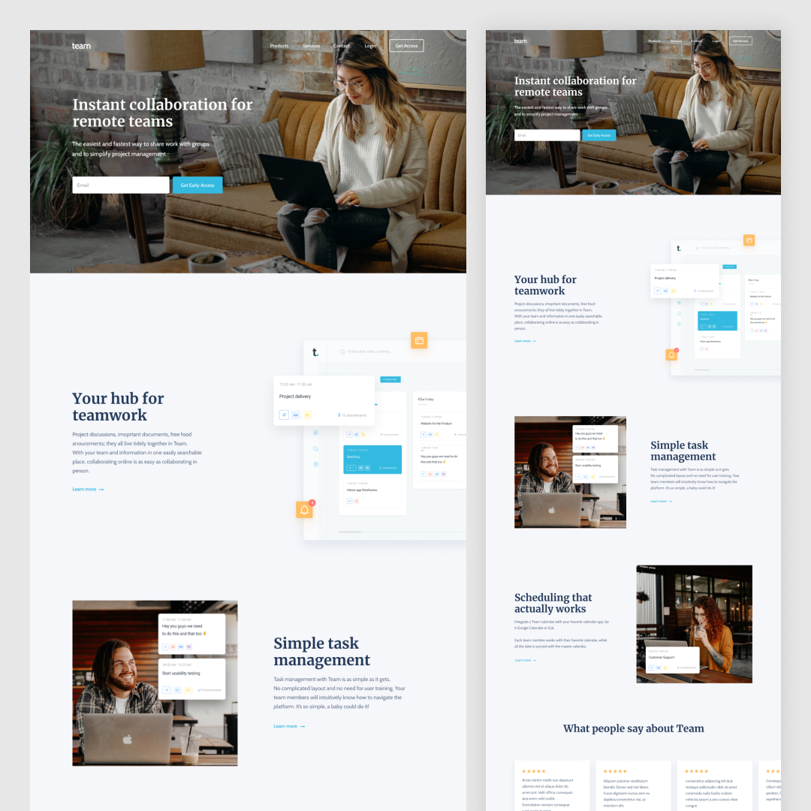

# Team - Featuring Next.js, GraphCMS and Apollo-client

## The Challenge⚡️

I wanted to build a JAMStack website using some modern technologies for the blog content. 

So I went with GraphCMS to fetch content, and I built some reusable components along the way.

Here was the challenge:

- View the optimal layout for each page depending on the device's screen size
- Seeing popular blogs on the blog page
- Providing all the content from GraphCMS (images, titles, descriptions etc.)
- Reading the detailed blog when clicking on it
- Implementing a responsive testimonials slider
- Ability to comment using disqus provider
- Beautiful scroll, javascript & css animations

## Built With ✨

- Apollo-client & GraphQL
- GraphCMS - Headless CMS
- [React](https://reactjs.org/) - JS library
- [Next.js](https://nextjs.org/) - React framework
- Typescript
- AOS - animation library

**Thanks for sharing** 🚀
